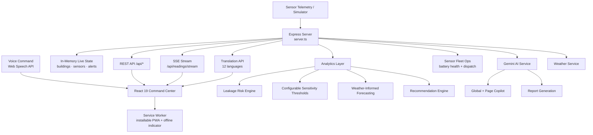

<div align="center">

# 💧 JalRakshak AI — Advance

### Voice-Controlled, Multilingual Water Intelligence Command Center

**Predict Water Loss. Prevent Waste. Protect Tomorrow — now in 12 languages, hands-free.**

[](https://jai-rakshak-ai-advance.vercel.app/)
[](https://vercel.com)
[](https://react.dev)
[](https://www.typescriptlang.org)
[](https://ai.google.dev)
[](#-voice-navigation)
[](#-pwa--offline-capabilities)
[](LICENSE)

<br/>

### 🔗 [**⚡ LAUNCH THE LIVE PLATFORM ⚡**](https://jai-rakshak-ai-advance.vercel.app/)

**`https://jai-rakshak-ai-advance.vercel.app/`**

<br/>

[Overview](#-overview) · [What's New](#-whats-new-in-advance) · [Key Features](#-core-capabilities) · [Voice Navigation](#-voice-navigation) · [Languages](#-languages) · [Architecture](#️-system-architecture) · [Tech Stack](#-tech-stack) · [API Reference](#-api-reference) · [Setup](#-getting-started) · [Deployment](#️-deployment)

</div>

---

## 📌 Overview

**JalRakshak AI** is a water intelligence platform that turns raw flow, pressure, tank, and quality telemetry into **early leak warnings, demand forecasts, and actionable conservation decisions**, with a live digital twin and a Gemini-powered copilot behind it.

The **Advance** edition pushes the command-center concept further: the entire interface is navigable **by voice**, every module is **live-translated into 12 languages**, and the platform now reasons about **real weather conditions** alongside sensor telemetry — all while keeping the sensor-fleet battery management, leak-sensitivity tuning, and installable PWA shell from the core platform.

---

## 🆕 What's New in Advance

| Capability | Description |
|---|---|
| 🎙️ **Hands-Free Voice Navigation** | Real Web Speech API integration — navigate every module, trigger simulations, and switch themes by voice command |
| 🌐 **12-Language Live Translation** | Full UI translation with a zero-latency built-in dictionary plus an AI translation API for anything beyond the core set |
| 🌦️ **Live Weather Integration** | A dedicated weather service feeding real atmospheric context into forecasting and risk reasoning |
| 🏛️ **Command Matrix Navigation** | A redesigned top navigation matrix and collapsible sidebar drawer built for rapid, dense, multi-module command-center use |
| ⌨️ **Keyboard Shortcut Manager** | Full keyboard-driven control for power users alongside voice and touch |
| 🌱 **Sustainability Pledges & Cheers** | Social-style engagement layer on top of conservation goals — pledge commitments and cheer on department progress |
| 🏷️ **Custom Campus Naming** | Rename the monitored campus/site directly from the dashboard |

---

## ✨ Core Capabilities

### 📊 Master Dashboard
Unified KPI view — today's consumption and delta vs yesterday, live flow rate, leakage risk %, active alerts, tank level, water-quality score, water saved, energy saved (kWh) and CO₂ avoided (kg).

### 📡 Real-Time Monitoring (SSE)
Server-Sent Events push telemetry to every connected client — flow (LPM), pressure (bar), tank level, inlet/outlet volume, consumption rate, pH, turbidity, TDS, temperature, and conductivity.

### 🧬 Digital Water Twin
A live virtual replica of the campus water network — zones, pipelines, buildings, and sensors — synchronized continuously to the incoming telemetry stream.

### 🚨 Anomaly & Leakage Detection Centre
Continuous inlet-vs-outlet reconciliation and pressure-signature analysis produce a **leakage risk score** with severity classification and building-level localization.

### 🎚️ Configurable Leak Sensitivity & Battery Thresholds
Per-site leak-detection sensitivity presets with a built-in threshold test runner, plus a configurable low-battery alert threshold across the sensor fleet.

### 🔋 Remote Sensor Battery Fleet Management
Live battery-health view across the sensor network, with direct operator actions to **replace battery** or **dispatch a field replacement**.

### 📈 Forecasting & Optimization
Demand forecasting for pumping schedules and tank management, now informed by live weather data, with optimization insights that prevent overflow and off-peak waste.

### 🧪 Water Quality Module
Tracks pH, turbidity (NTU), TDS (mg/L), conductivity (µS/cm) and temperature against a composite quality score.

### 🛠️ Predictive Maintenance
Converts detected anomalies into ranked, assignable maintenance tasks with full lifecycle tracking.

### 🎛️ Digital Twin Simulator
Inject failure scenarios — leakage risk, high consumption, pressure drop, tank overflow, low tank, water-quality anomaly, sensor failure — to validate detection logic and train operators, triggerable from the UI **or by voice command**.

### 🗺️ Geospatial & Multi-Building Comparison
Map-based view of the network plus side-by-side benchmarking of consumption and efficiency across buildings.

### 🤖 JalRakshak Copilot — Dual Mode
A global **JalRakshak Copilot** for platform-wide questions, plus a **page-contextual chatbot** scoped to whatever view the operator is currently looking at.

### 🌱 Sustainability Center
Conservation goals, achievement badges, department-level sustainability tracking, pledges, cheers, and AI-generated report drafts.

### 🔐 Authentication & Audit Log
A dedicated sign-in flow plus a full, immutable audit log of every operator action across the platform.

---

## 🎙️ Voice Navigation

JalRakshak Advance ships a real, working voice command layer built on the browser's native Speech Recognition API — not a scripted demo. Say the name of a module ("dashboard," "digital twin," "anomaly center") and the app navigates there; voice commands can also **inject a simulated pipe leak**, **restore normal telemetry**, or **switch the display theme**. If the browser doesn't support the Speech Recognition API, the same commands remain available through an interactive command panel, so the feature degrades gracefully rather than breaking.

---

## 🌐 Languages

Full interface translation across **English, Tamil, Hindi, Telugu, Kannada, Malayalam, Marathi, Bengali, Spanish, French, German, and Japanese** — common UI strings resolve instantly from a built-in zero-latency dictionary, with an AI-backed translation endpoint handling anything outside that core set.

---

## 📱 PWA & Offline Capabilities

Installs as a native-feeling Progressive Web App with a service worker, install prompt, update-available toast, and a persistent offline indicator — so operators stay oriented even when connectivity drops during a site visit.

---

## 🏗️ System Architecture



**Request flow:** telemetry tick → state update → analytics recomputation (sensitivity + weather-aware) → SSE broadcast → React command center re-renders → voice and keyboard inputs route through the same navigation layer as touch, with translation applied live across every module.

---

## 🧰 Tech Stack

| Layer | Technology |
|---|---|
| **Frontend** | React 19, TypeScript, Vite 8, Tailwind CSS 4 |
| **UI / UX** | Lucide React icons, Motion (animations), Recharts (visualization) |
| **Voice** | Web Speech API (`SpeechRecognition` / `webkitSpeechRecognition`) |
| **Localization** | 12-language i18n layer — built-in dictionary + AI translation fallback |
| **PWA** | Service Worker, Web App Manifest, install/update prompts |
| **Backend** | Node.js, Express 4, TypeScript (`tsx` / `esbuild`) |
| **AI** | Google Gemini via `@google/genai` |
| **Realtime** | Server-Sent Events (SSE) |
| **State** | React Context (`AppContext`, `LanguageContext`) |
| **Deployment** | Vercel (also ships a `render.yaml` for Render) |

---

## 🚀 Getting Started

### Prerequisites
- **Node.js 18+** (or Bun)
- A **Google Gemini API key** — [get one here](https://aistudio.google.com/apikey)
- A browser with microphone access for voice navigation (optional — graceful fallback provided)

### Installation

```bash
# 1. Clone the repository
git clone https://github.com/sathi2305/JaiRakshak_AI_Advance.git
cd JaiRakshak_AI_Advance

# 2. Install dependencies
npm install          # or: bun install

# 3. Configure environment
cp .env.example .env
# then add your Gemini key to .env

# 4. Start the dev server
npm run dev
```

The app runs at **http://localhost:3000**

### Environment Variables

```env
GEMINI_API_KEY="your_gemini_api_key"
APP_URL="http://localhost:3000"
```

> 🔐 `.env` is gitignored — never commit API keys. Rotate immediately if one is ever exposed.

### Available Scripts

| Command | Description |
|---|---|
| `npm run dev` | Start dev server with Vite middleware + HMR |
| `npm run build` | Build client (Vite) and bundle server (esbuild) |
| `npm start` | Run the production build |
| `npm run lint` | Type-check with `tsc --noEmit` |
| `npm run clean` | Remove build artifacts |

---

## 🔌 API Reference

**Base URL:** `https://jai-rakshak-ai-advance.vercel.app/api`

### System & Telemetry
| Method | Endpoint | Description |
|---|---|---|
| `GET` | `/health` | Service status check |
| `GET` | `/dashboard/summary` | Aggregated KPI payload |
| `GET` | `/campuses` | Campus registry |
| `POST` | `/campus/name` | Rename the monitored campus/site |
| `GET` | `/buildings`, `/buildings/:id` | Buildings with live metrics |
| `GET` | `/readings/latest`, `/readings/history` | Telemetry snapshots and history |
| `GET` | `/readings/stream` | **SSE** live telemetry stream |
| `GET` | `/weather` | Live weather data for the monitored site |

### Sensor Fleet Ops
| Method | Endpoint | Description |
|---|---|---|
| `GET` | `/sensors` | Sensor inventory and health |
| `POST` | `/sensors/:id/replace-battery` | Log a completed battery replacement |
| `POST` | `/sensors/:id/dispatch-replacement` | Schedule a field battery replacement |
| `GET` / `POST` | `/config/battery-threshold` | View or set the low-battery alert threshold |
| `GET` / `POST` | `/config/leak-thresholds` | View or set leak-detection sensitivity |
| `POST` | `/config/leak-thresholds/test` | Test a threshold configuration before applying it |

### Intelligence
| Method | Endpoint | Description |
|---|---|---|
| `GET` | `/anomalies`, `/leakage-risk`, `/forecast` | Detection, risk, and demand forecasting |
| `GET` | `/recommendations` | Ranked conservation actions |
| `POST` | `/recommendations/:id/apply` | Apply a recommendation |
| `GET` | `/water-quality` | Water quality parameters and score |
| `GET` | `/sustainability` | Goals, badges, and progress |
| `POST` | `/sustainability/pledge` | Submit a conservation pledge |
| `POST` | `/sustainability/cheer` | Cheer on a department's progress |

### Operations
| Method | Endpoint | Description |
|---|---|---|
| `GET` | `/alerts` | Active and historical alerts |
| `POST` | `/alerts/:id/acknowledge`, `/alerts/:id/resolve` | Acknowledge or resolve an alert |
| `GET` / `POST` | `/maintenance` | List or create maintenance tasks |
| `PATCH` | `/maintenance/:id` | Update a maintenance task |
| `GET` | `/audit` | Full operator audit log |

### Simulation, Localization & AI
| Method | Endpoint | Description |
|---|---|---|
| `POST` | `/simulator/mode`, `/simulator/inject` | Control the digital twin simulator |
| `POST` | `/simulations/run` | Run a what-if scenario |
| `GET` | `/reports`, `/reports/latest` | List generated reports |
| `POST` | `/reports/generate` | AI-generated report draft |
| `POST` | `/translate` | AI-backed translation for strings outside the core dictionary |
| `POST` | `/copilot`, `/copilot/chat` | Ask the JalRakshak Copilot |

---

## 🗂️ Project Structure

```
JaiRakshak_AI_Advance/
├── server.ts                    # Express API, SSE, weather, translation, Gemini
├── render.yaml                  # Render deployment blueprint
├── vite.config.ts               # Vite + React + Tailwind config
├── public/
│   ├── manifest.json            # PWA manifest
│   └── sw.js                    # Service worker
└── src/
    ├── main.tsx / App.tsx       # Entry point & root routing
    ├── types/index.ts           # Shared TypeScript types
    ├── context/AppContext.tsx   # Global app state
    ├── i18n/LanguageContext.tsx # 12-language dictionary & provider
    ├── hooks/useOnlineStatus.ts # Connectivity detection
    ├── services/
    │   ├── api.ts                 # API client
    │   ├── weatherService.ts      # Weather data fetching
    │   ├── telemetryStorage.ts    # Local telemetry caching
    │   └── notificationService.ts # Notification handling
    ├── data/
    │   ├── mockDatabase.ts            # Seed campuses, sensors, pipelines
    │   └── departmentSustainability.ts# Department sustainability seed data
    └── components/
        ├── auth/SignInPage.tsx
        ├── common/
        │   ├── VoiceNavigationManager.tsx   # Web Speech API voice control
        │   ├── LanguageSelector.tsx          # Language switcher
        │   ├── KeyboardShortcutManager.tsx   # Keyboard navigation
        │   ├── TopNavigationMatrix.tsx       # Command-center nav bar
        │   ├── PageMatrixBar.tsx              # Module matrix bar
        │   ├── CollapsibleSidebarDrawer.tsx   # Sidebar drawer
        │   ├── RemoteSensorBatteryMonitor.tsx # Battery fleet widget
        │   ├── NotificationCenterModal.tsx
        │   ├── OfflineIndicator.tsx / PwaUpdateToast.tsx / InstallPwaModal.tsx
        │   └── ErrorBoundary.tsx
        ├── dashboard/MasterDashboard.tsx
        ├── monitoring/RealTimeMonitoring.tsx
        ├── digitaltwin/DigitalWaterTwin.tsx
        ├── anomaly/AnomalyLeakageCenter.tsx
        ├── sensors/ (LeakSensitivityConfig · BatteryThresholdConfigUI · SensorHealthView)
        ├── forecast/ForecastOptimization.tsx
        ├── recommendations/RecommendationsView.tsx
        ├── simulator/ (DigitalTwinSimulator · SimulatorDrawer)
        ├── maintenance/PredictiveMaintenance.tsx
        ├── quality/WaterQualityModule.tsx
        ├── geospatial/GeospatialMap.tsx
        ├── comparison/MultiBuildingComparison.tsx
        ├── sustainability/SustainabilityCenter.tsx
        ├── reports/ReportCenter.tsx
        ├── audit/AuditLogView.tsx
        └── copilot/ (JalRakshakCopilot · PageContextualChatbot)
```

---

## ☁️ Deployment

Deployed on **Vercel**. A `render.yaml` blueprint is also included for Render deployment.

| Setting | Value |
|---|---|
| **Framework Preset** | Vite |
| **Build Command** | `npm run build` |
| **Output Directory** | `dist` |
| **Environment Variables** | `GEMINI_API_KEY` (set as a secret) |

**Live URL:** https://jai-rakshak-ai-advance.vercel.app/

---

## 🗺️ Roadmap

- [ ] Persistent database layer (PostgreSQL / TimescaleDB) replacing in-memory state
- [ ] Live IoT ingestion via MQTT from physical flow, pressure, and battery sensors
- [ ] ML-based leak classification trained on historical incident data
- [ ] Expanded voice command vocabulary with natural-language intent parsing
- [ ] SMS / WhatsApp alerting for field maintenance crews
- [ ] PDF export for sustainability and compliance reports
- [ ] Native mobile companion app for field technicians

---

## 🤝 Contributing

```bash
git checkout -b feature/your-feature-name
git commit -m "Add: clear description of your change"
git push origin feature/your-feature-name
# Open a Pull Request
```

Run `npm run lint` before submitting. New UI strings should be added to every language entry in `src/i18n/LanguageContext.tsx`, and new voice commands registered in `src/components/common/VoiceNavigationManager.tsx`.

---

## 📄 License

Distributed under the MIT License. See [`LICENSE`](LICENSE) for details.

---

## 👤 Author

**Sathiyamoorthi**

[](https://github.com/sathi2305)

---

<div align="center">

### ⭐ If this project helps you, consider starring the repository.

**[💧 Try the Live Platform](https://jai-rakshak-ai-advance.vercel.app/)**

*Every drop measured is a drop saved — in every language, hands-free.*

</div>
